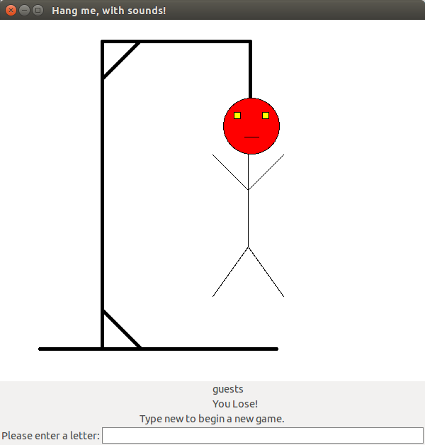

# Hang me, with sounds!

##Authors
Willis Hand

Laura Lucaciu

##Overview
This is our own implementation of the game Hangman. The game is played by guessing letters in an attempt to reveal a word that has been randomly selected. We added some sound effects and a GUI, making the game more engaging. Feel free to swap out our dictionary.txt with your own text file of words!

##Screenshot



##Concepts Demonstrated
* **Closures** are used in making the game object to create encapsulation for the word to be guessed. This prevents the user from cheating through the REPL.
* **High order procedures** are used in the filtering and parsing of the dictionary file. Filter is used to remove words outside of the hardcoded length limits and map is used to change the way that the words are interpreted from symbol to string.
* **Dispatch tables** are used in both the game object and in the callback function of the text box. This allows for one function to handle a variety of input.

##External Technology and Libraries

For the GUI code was used bitmap% object which is generated by a string corresponding to the contents of a url struct and is generating the deck for the hangman.
This is provided by the library provided by net/url https://docs.racket-lang.org/net/url.html?q=net%2Furl . Another library used for GUI is the lang/plt-pretty-big-text module which is similar to the HtDP. https://docs.racket-lang.org/htdp/index.html?q=lang%2Fplt-pretty-big-text#%28mod-path._lang%2Fplt-pretty-big-text%29 
Also for the canvas and the text-field box, which exist in the racket/gui/base https://docs.racket-lang.org/gui/index.html?q=racket%2Fgui%2Fbase
The sounds played using rsound audio streams https://docs.racket-lang.org/rsound/index.html?q=rsound .

##Favorite Scheme Expressions
####Willis
This is how I update the so called "word-in-progress" that is displayed to the player. It was a situation where using an iterative process to make a sort of for loop worked really well.
```scheme
(define word-in-progress (make-string (string-length wordlist) #\*))
(define (reveal key char count)
    (cond ((= count (string-length word-in-progress)) #t) 
      ((equal? (string-ref key count) char) (begin (string-set! word-in-progress count char) (reveal key char (+ 1 count))))
      ('else (reveal key char (+ 1 count)))))
```
####Laura 
This expression is loading the deck image into a 'canvas' by using the bitmap% object generating the contents of a url struct.

```scheme
; Make a frame by instantiating the frame% class 
(define f (new frame% [label "Hang me, with sounds!"] [width 600] [height 600]))
(define bm (make-object bitmap% (get-pure-port (string->url "https://raw.githubusercontent.com/oplS16projects/Laura-Willis/master/Deck.png"))))

(define pos -30)
;; Derive a new canvas (a drawing window) class
(define mycanvas%
  (class canvas%
  ;; Call the superclass init, passing on all init args
    (super-new)
    (inherit get-dc)
	;; Define overriding method to handle image repainted in the canvas 
         (define/override (on-paint)
            (let ([my-dc (get-dc)])
              (send my-dc draw-bitmap bm pos pos)))))

```

#How to Download and Run
To run, simply download the latest release and run the hangman.rkt file. To guess a letter, type the letter into the text box at the bottom of the window and press the enter key. Thats it!

Latest Release: https://github.com/oplS16projects/Laura-Willis/releases/tag/V1.0
